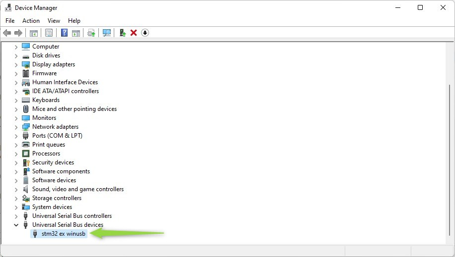
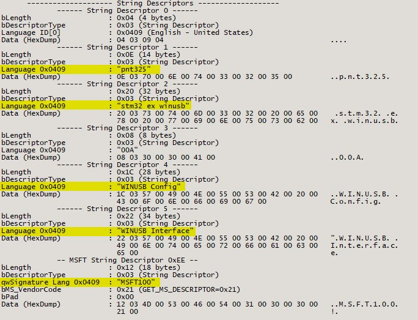
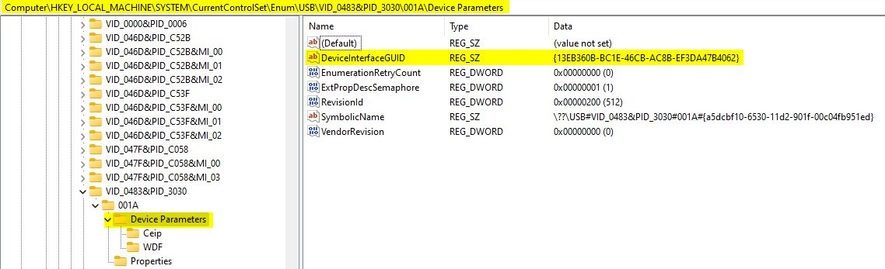

# stm32_winusb_example: The example implement on [STM32f746G-DISCO Board](https://www.st.com/en/evaluation-tools/32f746gdiscovery.html)

## Add component support configuration WINUSB
The source file `core/winusb/`
```
winusb_def.h
winusb.h
```

## File `usbd_config.h`
Add macro to use USB FS
```C
#define USE_USB_FS		/* define macro to use USB FS*/
```

## File `usbd_desc.c`

Add macro define USB serial number string
```C
#define USBD_SERIAL_NUMBER_STRING_FS	"00A"
```

Update the function `USBD_FS_SerialStrDescriptor` to response the `USBD_SERIAL_NUMBER_STRING_FS` value
```C
uint8_t * USBD_FS_SerialStrDescriptor(USBD_SpeedTypeDef speed, uint16_t *length)
{
	UNUSED(speed);
	if (speed == USBD_SPEED_HIGH) {
		USBD_GetString((uint8_t*) USBD_SERIAL_NUMBER_STRING_FS, USBD_StrDesc, length);
	} else {
		USBD_GetString((uint8_t*) USBD_SERIAL_NUMBER_STRING_FS, USBD_StrDesc, length);
	}
	return USBD_StrDesc;
}
```

Update `USBD_FS_DeviceDesc` data
```C
__ALIGN_BEGIN uint8_t USBD_FS_DeviceDesc[USB_LEN_DEV_DESC] __ALIGN_END =
{
	USB_LEN_DEV_DESC, /*bLength */
	USB_DESC_TYPE_DEVICE, /*bDescriptorType*/
#if (USBD_LPM_ENABLED == 1)
	0x01, 0x02, /*bcdUSB */
	/* changed to USB version 2.01 in order to support LPM L1 suspend resume test of USBCV3.0*/
#else
	0x00, 0x02,                      /*bcdUSB 2.1*/
#endif /* (USBD_LPM_ENABLED == 1) */
	0xEF, /*bDeviceClass*/
	0x02, /*bDeviceSubClass*/
	0x01, /*bDeviceProtocol*/
	USB_MAX_EP0_SIZE, /*bMaxPacketSize*/
	LOBYTE(USBD_VID), /*idVendor*/
	HIBYTE(USBD_VID), /*idVendor*/
	LOBYTE(USBD_PID_FS), /*idProduct*/
	HIBYTE(USBD_PID_FS), /*idProduct*/
	0x00, /*bcdDevice rel. 2.00*/
	0x02,
	USBD_IDX_MFC_STR, /*Index of manufacturer  string*/
	USBD_IDX_PRODUCT_STR, /*Index of product string*/
	USBD_IDX_SERIAL_STR, /*Index of serial number string*/
	USBD_MAX_NUM_CONFIGURATION /*bNumConfigurations*/
};
```
Update the USB descriptor show on windows when connect
```C
#define USBD_VID                      1155
#define USBD_LANGID_STRING            1033
#define USBD_MANUFACTURER_STRING      "pnt325"
#define USBD_PID_FS                   12336
#define USBD_PRODUCT_STRING_FS        "stm32 ex winusb"
#define USBD_SERIAL_NUMBER_STRING_FS  "00A"
#define USBD_CONFIGURATION_STRING_FS  "WINUSB Config"
#define USBD_INTERFACE_STRING_FS      "WINUSB Interface"
```

## File `usbd_cdc.c`

Add macro `WINUSB_CONFIG_DESC_SIZE`
```C
#define WINUSB_CONFIG_DESC_SIZE           32
```

Update `USBD_CDC_CfgFSDesc` data
```C
__ALIGN_BEGIN uint8_t USBD_CDC_CfgFSDesc[WINUSB_CONFIG_DESC_SIZE] __ALIGN_END =
{
  /*Configuration Descriptor*/
  0x09,   							/* bLength: Configuration Descriptor size */
  USB_DESC_TYPE_CONFIGURATION,      /* bDescriptorType: Configuration */
  WINUSB_CONFIG_DESC_SIZE,          /* wTotalLength:no of returned bytes */
  0x00,
  0x01,   							/* bNumInterfaces: 1 interface for Game IO */
  0x01,   							/* bConfigurationValue: Configuration value */
  USBD_IDX_CONFIG_STR,  /* iConfiguration: Index of string descriptor describing the configuration */
  0xC0,   							/* bmAttributes: self powered */
  0x32,   							/* MaxPower 0 mA */

  /*---------------------------------------------------------------------------*/

  /* interface descriptor*/
  0x09,   					/* bLength: Endpoint Descriptor size */
  USB_DESC_TYPE_INTERFACE,  /* bDescriptorType: */
  0x00,   /* bInterfaceNumber: Number of Interface, zero based index of this interface */
  0x00,   /* bAlternateSetting: Alternate setting */
  0x02,   /* bNumEndpoints: Two endpoints used */
  0xef,   /* bInterfaceClass: vendor, setting: None */
  0x02,   /* bInterfaceSubClass: ACM*/
  0x01,   /* bInterfaceProtocol: protocol AT*/
  USBD_IDX_INTERFACE_STR,   /* iInterface: index of interface name */

  /*Endpoint OUT Descriptor*/
  0x07,   /* bLength: Endpoint Descriptor size */
  USB_DESC_TYPE_ENDPOINT,      			/* bDescriptorType: Endpoint */
  CDC_OUT_EP,                        	/* bEndpointAddress */
  0x03,                              	/* bmAttributes: interrupt transfer, bulk = 2*/
  LOBYTE(CDC_DATA_FS_MAX_PACKET_SIZE),  /* wMaxPacketSize: */
  HIBYTE(CDC_DATA_FS_MAX_PACKET_SIZE),
  0x01,                              	/* bInterval: ignore for Bulk transfer */

  /*Endpoint IN Descriptor*/
  0x07,   								/* bLength: Endpoint Descriptor size */
  USB_DESC_TYPE_ENDPOINT,      			/* bDescriptorType: Endpoint */
  CDC_IN_EP,                         	/* bEndpointAddress */
  0x03,                              	/* bmAttributes: interrupt transfer, bulk = 2 */
  LOBYTE(CDC_DATA_FS_MAX_PACKET_SIZE),  /* wMaxPacketSize: */
  HIBYTE(CDC_DATA_FS_MAX_PACKET_SIZE),
  0x01                               	/* bInterval: ignore for Bulk transfer */
} ;
```

## File `usbd_ctlreq.c`

Include `winusb.h` header
```C
#include "winusb.h"
```

Update function `USBD_StdDevReq` insert code

```C
if (req->bmRequest == 0xC0 && req->bRequest == winusb_get_vendor_code()) {
    winusb_get_desc(pdev, req);
    return ret;
}
```
to begin of function:
```C
USBD_StatusTypeDef USBD_StdDevReq(USBD_HandleTypeDef *pdev, USBD_SetupReqTypedef *req)
{
  USBD_StatusTypeDef ret = USBD_OK;

  if (req->bmRequest == 0xC0 && req->bRequest == winusb_get_vendor_code()) {
		winusb_get_desc(pdev, req);
		return ret;
  }
  ...
```

Update function `USBD_StdItfReq` insert code bellow to begin of `case USBD_STATE_CONFIGURED:`
```C
if (req->bmRequest == 0xC1 && req->bRequest == winusb_get_vendor_code() && req->wIndex == 0x05) {
    winusb_get_desc(pdev, req);
    break;
}    
```

Update function `USBD_GetDescriptor` add  `case: 0xEE` bellow `case USBD_IDX_INTERFACE_STR`
```C
case 0xEE:
    pbuf = winusb_get_ms_os_string_desc(&len);
    break;
```

## Build and flash to device, plug USB to windows, open windows manager to check if the device show like image bellow that implement success

</img>

## Use usb tools to verify the config and descriptor data
In this example I use tool [UsbTreeView](https://www.uwe-sieber.de/usbtreeview_e.html)

</img>

## Note

- Windows only request MSFT desroptor on the first time device connected. To test device multiple-time should be remove registry data, in this exmaple my device vid = 0483h, pid = 3030h

usbflags
```
Computer\HKEY_LOCAL_MACHINE\SYSTEM\CurrentControlSet\control\usbflags\048330300200
```
Enum
```
Computer\HKEY_LOCAL_MACHINE\SYSTEM\CurrentControlSet\enum\usb\vid_0483&PID_3030
```

- Connnect to read/write form USB using windows supported winusb_driver the usb device connected to window should know `DeviceInterfaceGUID` on registry
```
Computer\HKEY_LOCAL_MACHINE\SYSTEM\CurrentControlSet\Enum\USB\VID_0483&PID_3030\001A\Device Parameters
```

</img>